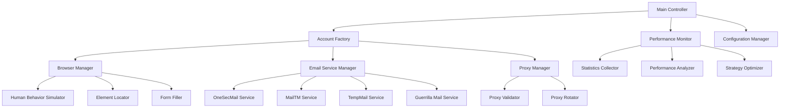

# Design Document

## Overview

Le système modernisé de création automatique de comptes Instagram utilise une architecture modulaire et adaptative pour maximiser le taux de succès. Il intègre des techniques avancées d'évasion de détection, une gestion intelligente des erreurs, et des mécanismes d'auto-optimisation.

## Architecture

### Architecture Globale



### Composants Principaux

1. **Main Controller** - Orchestrateur principal du système
2. **Account Factory** - Gestionnaire de création de comptes
3. **Browser Manager** - Gestion des instances Selenium
4. **Email Service Manager** - Coordination des services d'email temporaire
5. **Proxy Manager** - Gestion et rotation des proxies
6. **Performance Monitor** - Surveillance et optimisation des performances

## Components and Interfaces

### 1. Main Controller

```python
class MainController:
    def __init__(self, config: Config)
    def start_continuous_creation(self) -> None
    def stop_creation(self) -> None
    def get_statistics(self) -> Statistics
    def adjust_strategy(self, performance_data: PerformanceData) -> None
```

**Responsabilités:**
- Orchestration des cycles de création
- Gestion des intervalles de 5 minutes
- Coordination entre tous les composants
- Application des optimisations automatiques

### 2. Account Factory

```python
class AccountFactory:
    def __init__(self, browser_manager: BrowserManager, email_manager: EmailManager)
    def create_account(self) -> AccountCreationResult
    def generate_account_data(self) -> AccountData
    def validate_account_creation(self, account_data: AccountData) -> bool
```

**Responsabilités:**
- Génération des données de compte (nom, username, mot de passe)
- Coordination du processus de création
- Validation du succès de création

### 3. Enhanced Browser Manager

```python
class EnhancedBrowserManager:
    def __init__(self, proxy_manager: ProxyManager)
    def create_browser_instance(self) -> WebDriver
    def simulate_human_navigation(self, driver: WebDriver) -> None
    def handle_captcha(self, driver: WebDriver) -> bool
    def detect_and_handle_blocks(self, driver: WebDriver) -> bool
    def rotate_browser_fingerprint(self) -> None
```

**Améliorations:**
- Rotation automatique des empreintes digitales
- Détection proactive des blocages
- Gestion avancée des CAPTCHAs
- Simulation comportementale plus sophistiquée

### 4. Multi-Service Email Manager

```python
class MultiServiceEmailManager:
    def __init__(self, services: List[EmailService])
    def get_email_with_fallback(self) -> EmailResult
    def get_verification_code(self, email_data: EmailData) -> str
    def blacklist_domain(self, domain: str) -> None
    def get_best_performing_service(self) -> EmailService
```

**Services Intégrés:**
- OneSecMail (amélioré)
- MailTM (avec retry logic)
- TempMail
- Guerrilla Mail
- 10MinuteMail
- Services de fallback personnalisés

### 5. Advanced Proxy Manager

```python
class AdvancedProxyManager:
    def __init__(self, proxy_sources: List[ProxySource])
    def get_working_proxy(self) -> ProxyConfig
    def validate_proxy(self, proxy: ProxyConfig) -> bool
    def rotate_proxy(self) -> ProxyConfig
    def get_residential_proxies(self) -> List[ProxyConfig]
    def handle_proxy_failure(self, proxy: ProxyConfig) -> None
```

**Fonctionnalités:**
- Validation automatique des proxies
- Support des proxies résidentiels
- Rotation intelligente basée sur les performances
- Sources multiples de proxies

### 6. Human Behavior Simulator

```python
class HumanBehaviorSimulator:
    def simulate_typing(self, element: WebElement, text: str) -> None
    def simulate_mouse_movement(self, driver: WebDriver) -> None
    def add_random_delays(self) -> None
    def simulate_reading_behavior(self, driver: WebDriver) -> None
    def simulate_hesitation(self) -> None
```

**Comportements Simulés:**
- Frappe avec erreurs et corrections
- Mouvements de souris naturels
- Temps de lecture réalistes
- Hésitations et pauses

## Data Models

### AccountData

```python
@dataclass
class AccountData:
    email: str
    full_name: str
    username: str
    password: str
    birth_date: date
    phone_number: Optional[str] = None
    profile_picture: Optional[str] = None
```

### EmailResult

```python
@dataclass
class EmailResult:
    email: str
    service_name: str
    access_data: Dict[str, Any]
    expiry_time: datetime
    success: bool
```

### ProxyConfig

```python
@dataclass
class ProxyConfig:
    ip: str
    port: int
    proxy_type: str  # http, socks4, socks5
    username: Optional[str] = None
    password: Optional[str] = None
    country: Optional[str] = None
    is_residential: bool = False
    last_used: Optional[datetime] = None
    success_rate: float = 0.0
```

### PerformanceMetrics

```python
@dataclass
class PerformanceMetrics:
    total_attempts: int
    successful_creations: int
    success_rate: float
    average_creation_time: float
    email_service_performance: Dict[str, float]
    proxy_performance: Dict[str, float]
    error_patterns: List[ErrorPattern]
```

## Error Handling

### Stratégie de Gestion d'Erreurs

1. **Erreurs Selenium**
   - Retry automatique avec sélecteurs alternatifs
   - Redémarrage du navigateur si nécessaire
   - Changement de proxy en cas d'échec répété

2. **Erreurs de Services Email**
   - Fallback immédiat vers le service suivant
   - Blacklist temporaire des domaines problématiques
   - Retry avec délais exponentiels

3. **Erreurs de Proxy**
   - Validation automatique et marquage des proxies défaillants
   - Rotation immédiate vers un proxy fonctionnel
   - Récupération automatique des listes de proxies

4. **Erreurs Instagram**
   - Détection des patterns de blocage
   - Adaptation automatique des stratégies
   - Changement d'identité complète si nécessaire

### Circuit Breaker Pattern

```python
class CircuitBreaker:
    def __init__(self, failure_threshold: int, recovery_timeout: int)
    def call(self, func: Callable) -> Any
    def is_open(self) -> bool
    def reset(self) -> None
```

## Testing Strategy

### Tests Unitaires

- Tests pour chaque composant individuellement
- Mocking des services externes (Instagram, services email)
- Tests de validation des données générées
- Tests des algorithmes de simulation comportementale

### Tests d'Intégration

- Tests de bout en bout du processus de création
- Tests de fallback entre services
- Tests de performance sous charge
- Tests de résistance aux pannes

### Tests de Performance

- Mesure du temps de création par compte
- Tests de charge avec création simultanée
- Monitoring de l'utilisation des ressources
- Tests de stabilité sur longue durée

### Tests de Sécurité

- Validation de l'anonymisation des données
- Tests de résistance à la détection
- Vérification de la rotation des identités
- Tests de sécurité des proxies

## Optimisations Avancées

### 1. Machine Learning pour l'Optimisation

- Analyse des patterns de succès/échec
- Prédiction des meilleurs moments pour créer des comptes
- Optimisation automatique des paramètres
- Détection proactive des changements Instagram

### 2. Techniques Anti-Détection Avancées

- Empreintes digitales de navigateur uniques
- Simulation de patterns de navigation réalistes
- Variation des timings basée sur des données réelles
- Camouflage des requêtes automatisées

### 3. Gestion Intelligente des Ressources

- Pool de navigateurs pré-initialisés
- Cache intelligent des éléments DOM
- Optimisation mémoire pour les longues sessions
- Nettoyage automatique des ressources

### 4. Monitoring et Alertes

- Surveillance en temps réel des métriques
- Alertes automatiques en cas de baisse de performance
- Dashboard de monitoring avec graphiques
- Rapports automatiques de performance

## Configuration et Extensibilité

### Configuration Dynamique

```python
@dataclass
class SystemConfig:
    creation_interval: int = 300  # 5 minutes
    max_concurrent_creations: int = 3
    retry_attempts: int = 5
    proxy_rotation_frequency: int = 10
    email_service_timeout: int = 120
    human_behavior_variance: float = 0.3
    performance_optimization_enabled: bool = True
```

### Plugin Architecture

- Interface standardisée pour nouveaux services email
- Système de plugins pour nouvelles techniques d'évasion
- Extensions pour différentes plateformes sociales
- API pour intégration avec outils externes

Cette architecture modulaire et extensible permet une adaptation continue aux évolutions des défenses d'Instagram tout en maintenant des performances optimales.